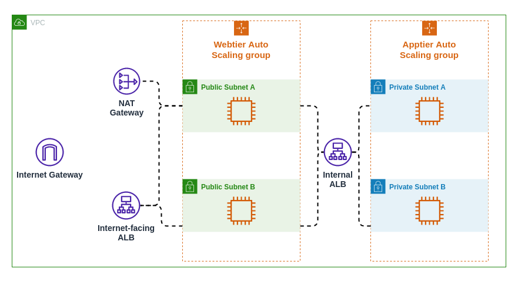

# AWS CloudFormation Automated Deployment

## [Application stack template](app-stack.json)

Deploys the following in a virtual private cloud (VPC) (created by the [network stack template](network-stack.json)):
- Auto Scaling group in the public web tier
- Internet-facing application load balancer for the web tier
- Auto Scaling group in the application tier
- Internal application load balancer for the application tier
- Security groups

## [Network stack nested template](network-stack.json)

Deploys the following:
- A virtual Private Cloud (VPC)
- Two public subnets in different zones
- Two private subnets in different zones
- Internet gateway
- NAT gateway

## Architecture Diagram

## Credits

Based on the Pluralsight Architecting for Reliability on AWS, Automated Deployments with CloudFormation course by Ben Piper.